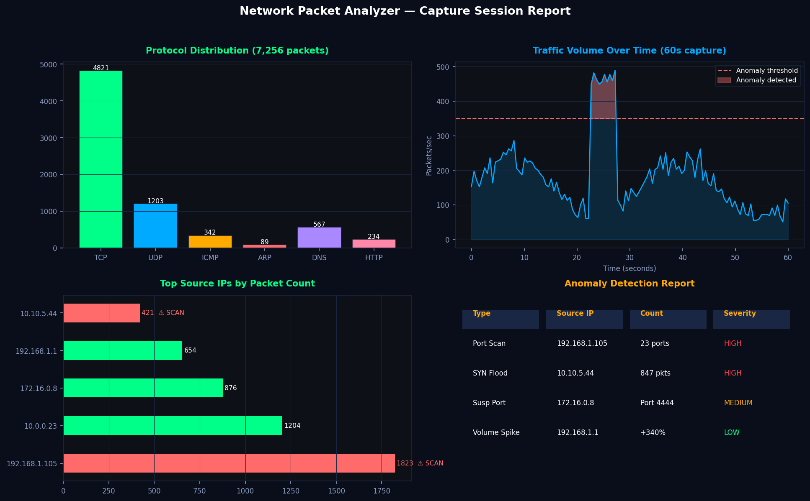

# Network Packet Analyzer




## 📌 Project Overview

A Python-based network packet capture and anomaly detection tool built with **Scapy**. Captures live network traffic (or runs in demo mode), analyzes protocol distribution, detects suspicious behavior patterns, and generates structured JSON and CSV reports.

---

## ✨ Features

- **Live packet capture** using Scapy (requires root/sudo)
- **Demo mode** — runs without root using simulated realistic traffic
- **Protocol analysis** — TCP, UDP, ICMP, ARP, DNS breakdown
- **Anomaly detection** — port scans, high-frequency floods, suspicious ports
- **Structured reporting** — JSON summary + CSV packet log + CSV anomaly report
- **Traffic statistics** — packets/sec, top talkers, unique IPs, DNS queries

---

## 🛠️ Tech Stack

| Tool | Purpose |
|---|---|
| Python 3.10+ | Core language |
| Scapy 2.5+ | Packet capture and parsing |
| collections.Counter | Traffic frequency analysis |
| json / csv | Report generation |

---

## 📁 Project Structure

```
network-packet-analyzer/
│
├── analyzer.py        # Main capture engine + anomaly detection
├── report.py          # JSON and CSV report generation
├── requirements.txt   # Python dependencies
├── reports/           # Auto-generated output reports
│   ├── report_YYYYMMDD_HHMMSS.json
│   ├── packets_YYYYMMDD_HHMMSS.csv
│   └── anomalies_YYYYMMDD_HHMMSS.csv
└── README.md
```

---

## 🚀 Getting Started

### 1. Clone the repo
```bash
git clone https://github.com/raashidshaik/network-packet-analyzer.git
cd network-packet-analyzer
```

### 2. Install dependencies
```bash
pip install -r requirements.txt
```

### 3. Run in demo mode (no root required)
```bash
python analyzer.py
```

### 4. Run live capture (requires root)
```bash
sudo python analyzer.py
```

---

## 🔍 Anomaly Detection Rules

| Anomaly Type | Trigger Condition | Severity |
|---|---|---|
| `PORT_SCAN` | Single IP accesses 15+ unique ports | HIGH |
| `HIGH_FREQUENCY` | Single IP sends 50+ packets | MEDIUM |
| `SUSPICIOUS_PORT` | Access to ports: 22, 23, 3389, 4444, 5900, 6666, 31337 | HIGH |

---

## 📊 Sample Output

```
============================================================
  NETWORK PACKET ANALYZER
  Started: 2025-01-15 14:32:01
============================================================

📦 Generating 200 simulated packets in demo mode...

  ⚠  Injecting port scan from 172.16.0.99...
  ⚠  Injecting high-frequency flood from 10.10.10.10...
  ⚠  Injecting suspicious port access from 192.168.1.77...
  ✓ Demo packets generated: 288 total

🔍 Running anomaly detection...
  ✓ JSON report   : reports/report_20250115_143201.json
  ✓ Packet log CSV: reports/packets_20250115_143201.csv
  ✓ Anomaly CSV   : reports/anomalies_20250115_143201.csv

============================================================
  ANALYSIS SUMMARY
============================================================
  Total Packets    : 288
  Unique IPs       : 21
  Duration         : 0.42s
  Packets/sec      : 685.7

  Protocol Breakdown:
    TCP     :   138 packets
    UDP     :    82 packets
    DNS     :    22 packets
    ICMP    :    21 packets
    ARP     :    11 packets

  🚨 Anomalies Detected: 4
    [HIGH]   PORT_SCAN     — 172.16.0.99
    [MEDIUM] HIGH_FREQUENCY — 10.10.10.10
    [HIGH]   SUSPICIOUS_PORT — 192.168.1.77
============================================================
```

---

## 📄 Report Outputs

### `report_*.json` — Summary Report
```json
{
  "report_generated": "2025-01-15T14:32:01",
  "summary": {
    "total_packets": 288,
    "unique_ips": 21,
    "protocol_breakdown": {"TCP": 138, "UDP": 82, ...}
  },
  "anomaly_count": 4,
  "severity_counts": {"HIGH": 3, "MEDIUM": 1, "LOW": 0},
  "anomalies": [...]
}
```

### `anomalies_*.csv` — Anomaly Report
```
type,severity,src_ip,detail,detected_at
PORT_SCAN,HIGH,172.16.0.99,Accessed 25 unique ports: [20, 21, 22...],...
HIGH_FREQUENCY,MEDIUM,10.10.10.10,Sent 60 packets — possible flood,...
```

---

## 👤 Author

**Raashid Shaik**
M.S. Management Information Systems — Lamar University (GPA 3.90)
📧 shaikraashid088@gmail.com
🔗 [LinkedIn](https://linkedin.com/in/raashid-shaik-53a3)
🐙 [GitHub](https://github.com/raashidshaik)
